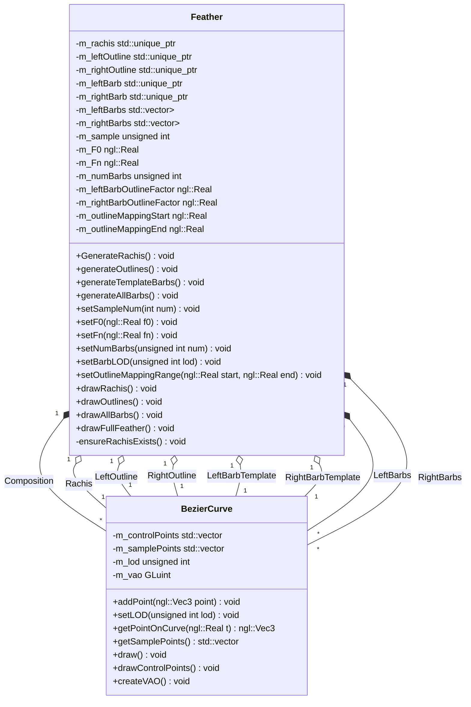

# NGLFeatherGen

A Qt-based application that demonstrates procedural feather generation using
the NGL graphics library. Feathers are created from Bezier curves for the rachis,
outlines and barbs then rendered in an OpenGL scene.

## Build

1. Install dependencies:
    - CMake >= 3.12
    - NGL library https://github.com/NCCA/NGL.git
    - Qt5 or Qt6 (Widgets and OpenGLWidgets)
    - GoogleTest for optional unit tests

2. Configure and build:

   ```bash
   mkdir build
   cd build
   cmake -G -Ninja ..
   ninja

## Usage
Run the generated Feather executable. The UI provides tabs to tweak rachis,
outline, barb, and full-feather parameters. Press Render to regenerate the
feather with the current settings.

Note: Render output depends on current tab i.e. Only show rachis when pressing render under Rachis tab. 
   
## Diagram
